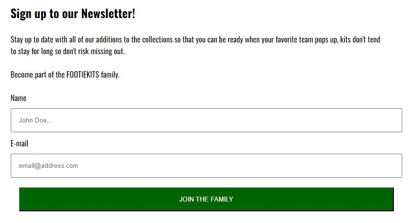

# FOOTIEKITS

FOOTIEKITS purpose is to expand the knowledge of a physical store located in the Stockholm suburb Trångsund.
There is a possibility for the user to look at the current collection available in store.

Newsletter fuctionality is set up for users to stay up to date with the newest trends in football kits,
or just to keep informed of new arrivals to the collection.

About section introduces the users shortly to football kits and gives an understanding of what the idea of
FOOTIEKITS is and what we try to achieve.

[View FOOTIEKITS live project here](https://chrisgustafsson.github.io/footiekit-PP1/)

- - -

## User Experience (UX)

Purpose of the page is to be a platform for football kit information and also drive traffic to the physical store.
Through an easy navigation bar and a easy way to sign up for a newsletter to stay up to date the user can easily achieve the goal with the webpage.
Collection and location which are meant to drive users to the physical store is also easy accessible, addition of a map to even more state the physical presence.

### User Stories (Goals)

* First time visitor
  * Learn about football kits
  * Navigate through the page
  * "Join the family" / Sign up for a newsletter

* Returning visitor
  * Learn about FOOTIEKITS
  * Look at the collection of kits

* Frequent user
  * Keeping up with new addition of kits
  * Visiting store (need improvement to track)

- - -

## Features

* Targeting the user interested in football and specifically the kit section of the sport
* By navigating to the newsletter page and sign-up we can provide them with the latest news in store and general
* Responsive flow

### Existing Features

* Navigation bar
  * Connected to header element and seen all across the pages
  * Links for Home, Collection, About, Newsletter
  * Always accesible making it easy to navigate

* Location, Opening hours + Map
  * All you need to find the physical store and opening times
  * Located on homepage as it is one of the key purposes

* Footer
  * Links to all social media pages
  * To increase traffic to our social media presence
  * Accesible on all pages

* Collection
  * Main purpose to showcase physical store inventory
  * Share the beauty of football kits

* About FOOTIEKITS
  * Information regarding the purpose of the store
  * "Get-to-know" FOOTIEKITS shortly

* Football kits
  * Brief info about football kits as a booming trend
  * "Get-to-know" football kits shortly

* About links
  * Connect the about section directly to collection and newsletter
  * To go back to the main purpose to sign up for a newsletter or visit a physical store
  * Put the user on the right track by providing wishful options in the flow of text.

 

* Newsletter
  * For the user to stay up to date
  * Potential to further develop
  * Build a connection between user and FOOTIEKITS

- - -

## Future Features

* E-commerce possibilities
  * Book a kit
  * Bid on a kit
* Contact-us section for further contact user <-> FOOTIEKITS

- - -

## Design

* Colors used are office green, black and white.
  * Office green / Dark green to connect to an expected color of a football pitch
  * Black and white for good contrasts and readability

* Typography
  * Righteous for the logotype with sans-serif as a fallback
  * Oswald for the content with sans-serif as a fallback

* Wireframes
  * Created in balsamiq

Desktop

Mobile

- - -

## Technologies Used

* [HTML5](https://en.wikipedia.org/wiki/HTML5)
* [CSS3](https://en.wikipedia.org/wiki/CSS)

- - -

## Frameworks, Libraries & Programs Used

* [Codeanywhere](https://codeanywhere.com/)
  * To write the code.
* [Github](https://github.com/)
  * Deployment of the website and storing the files online.
* [Google Fonts](https://fonts.google.com/)
  * Import font used for logotype and content
* [Am I Responsive](https://ui.dev/amiresponsive)
  * Picture for the README file.
* [Font Awesome](https://fontawesome.com/)
  * For social media icons
* [balsamiq](https://balsamiq.com/)
  * For creation of wireframes

- - -

## Testing

The W3C Markup Validator and W3C CSS Validator services were used to validate every page of the project to ensure there were no errors.

* [W3C Markup Validator](https://validator.w3.org/)
* [W3C CSS Validator](https://jigsaw.w3.org/css-validator/)

### Validation results

* Home, Collection, About, Newsletter HTML
  

* Style CSS

### Manual testing

* Tested on browsers Google Chrome and Safari due to the most amount of traffic
* Devices used IPHONE 13, Samsung Galaxy S22, Desktop computer and laptop
* Help from family and friends to test and get a first impression
* Developer tools in Google Chrome
